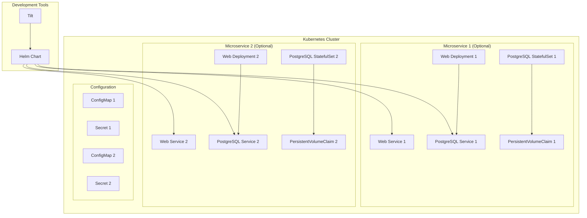

# Проектный документ

## Обзор

Проект представляет собой систему из двух независимых тестовых микросервисов для изучения Kubernetes. Каждый микросервис состоит из веб-приложения и собственной базы данных PostgreSQL с персистентным хранилищем. Система использует Helm для управления развертыванием и Tilt для автоматизации разработки. Ключевой особенностью является модульная архитектура - каждый микросервис можно включать/отключать независимо, при этом его база данных и персистентное хранилище создаются только при необходимости.

## Архитектура

### Общая архитектура



### Примеры конфигураций чартов

#### Пример 1: Полная конфигурация (разработка)
```yaml
# dev-values.yaml
microservice1:
  enabled: true
  webApp:
    replicas: 1
  postgres:
    enabled: true
    persistence:
      enabled: true
      size: 2Gi

microservice2:
  enabled: true
  webApp:
    replicas: 1
  postgres:
    enabled: true
    persistence:
      enabled: true
      size: 2Gi
```

**Результат развертывания:**
- Микросервис 1: Web Deployment + Service + PostgreSQL StatefulSet + Service + PVC (2Gi)
- Микросервис 2: Web Deployment + Service + PostgreSQL StatefulSet + Service + PVC (2Gi)
- ConfigMaps и Secrets для обоих микросервисов

#### Пример 2: Только первый микросервис
```yaml
# service1-only-values.yaml
microservice1:
  enabled: true
  webApp:
    replicas: 1
  postgres:
    enabled: true
    persistence:
      enabled: true
      size: 1Gi

microservice2:
  enabled: false    # Второй микросервис отключен
```

**Результат развертывания:**
- Только ресурсы микросервиса 1
- Никаких ресурсов для микросервиса 2 не создается

#### Пример 3: Оба микросервиса без персистентности
```yaml
# test-values.yaml
microservice1:
  enabled: true
  webApp:
    replicas: 1
  postgres:
    enabled: true
    persistence:
      enabled: false   # Временное хранилище

microservice2:
  enabled: true
  webApp:
    replicas: 1
  postgres:
    enabled: true
    persistence:
      enabled: false   # Временное хранилище
```

**Результат развертывания:**
- Оба микросервиса с PostgreSQL
- EmptyDir volumes (данные удаляются при рестарте)
- Никаких PVC не создается

### Структура проекта

```
k8s-helm-tilt-service/
├── Tiltfile                    # Конфигурация Tilt
├── docker/
│   ├── microservice1/
│   │   ├── Dockerfile
│   │   └── src/
│   │       └── app.py          # Веб-приложение микросервиса 1
│   └── microservice2/
│       ├── Dockerfile
│       └── src/
│           └── app.py          # Веб-приложение микросервиса 2
├── helm-chart/
│   ├── Chart.yaml
│   ├── values.yaml
│   └── templates/
│       ├── microservice1/
│       │   ├── web-deployment.yaml
│       │   ├── web-service.yaml
│       │   ├── postgres-statefulset.yaml
│       │   ├── postgres-service.yaml
│       │   ├── postgres-pvc.yaml
│       │   ├── configmap.yaml
│       │   └── secret.yaml
│       └── microservice2/
│           ├── web-deployment.yaml
│           ├── web-service.yaml
│           ├── postgres-statefulset.yaml
│           ├── postgres-service.yaml
│           ├── postgres-pvc.yaml
│           ├── configmap.yaml
│           └── secret.yaml
├── environments/
│   ├── dev-values.yaml         # Полная конфигурация (оба микросервиса)
│   ├── service1-only-values.yaml # Только первый микросервис
│   ├── service2-only-values.yaml # Только второй микросервис
│   └── test-values.yaml        # Без персистентного хранилища
└── docs/
    └── README.md
```

## Компоненты и интерфейсы

### 1. Микросервис 1

**Веб-приложение:**
- Технологии: Python Flask
- Контейнер: microservice1:latest
- Порт: 5001
- Endpoints: `/health`, `/db-status`, `/api/service1`

**База данных:**
- PostgreSQL 15
- Контейнер: postgres:15
- Порт: 5432
- База данных: service1_db
- DNS: `postgres-service1.default.svc.cluster.local`

**Ресурсы Kubernetes:**
- Deployment + Service для веб-приложения
- StatefulSet + Service для PostgreSQL
- PersistentVolumeClaim (условно)
- ConfigMap + Secret

### 2. Микросервис 2

**Веб-приложение:**
- Технологии: Python Flask
- Контейнер: microservice2:latest
- Порт: 5002
- Endpoints: `/health`, `/db-status`, `/api/service2`

**База данных:**
- PostgreSQL 15
- Контейнер: postgres:15
- Порт: 5432
- База данных: service2_db
- DNS: `postgres-service2.default.svc.cluster.local`

**Ресурсы Kubernetes:**
- Deployment + Service для веб-приложения
- StatefulSet + Service для PostgreSQL
- PersistentVolumeClaim (условно)
- ConfigMap + Secret

### 3. Helm Chart

**Структура конфигурации:**

```yaml
# values.yaml
global:
  namespace: default

microservice1:
  enabled: true
  webApp:
    image:
      repository: microservice1
      tag: latest
    service:
      port: 80
      targetPort: 5001
    replicas: 1
  postgres:
    enabled: true
    image:
      repository: postgres
      tag: "15"
    service:
      port: 5432
    persistence:
      enabled: true
      size: 1Gi
    auth:
      database: service1_db
      username: service1_user

microservice2:
  enabled: true
  webApp:
    image:
      repository: microservice2
      tag: latest
    service:
      port: 80
      targetPort: 5002
    replicas: 1
  postgres:
    enabled: true
    image:
      repository: postgres
      tag: "15"
    service:
      port: 5432
    persistence:
      enabled: true
      size: 1Gi
    auth:
      database: service2_db
      username: service2_user
```

### 4. Tilt конфигурация

**Основные функции:**
- Автоматическая сборка Docker образов
- Развертывание через Helm
- Live reload для веб-приложения
- Мониторинг логов и статуса

## Модели данных

### Конфигурационная модель

```yaml
# Полная схема values.yaml
global:
  namespace: string
  labels: map[string]string

microservice1:
  enabled: boolean
  webApp:
    image:
      repository: string
      tag: string
      pullPolicy: string
    service:
      type: string
      port: integer
      targetPort: integer
    replicas: integer
    resources:
      requests:
        cpu: string
        memory: string
      limits:
        cpu: string
        memory: string
  postgres:
    enabled: boolean
    image:
      repository: string
      tag: string
    service:
      port: integer
    persistence:
      enabled: boolean
      size: string
      storageClass: string
    auth:
      database: string
      username: string
      password: string
    resources:
      requests:
        cpu: string
        memory: string
      limits:
        cpu: string
        memory: string

microservice2:
  enabled: boolean
  webApp:
    image:
      repository: string
      tag: string
      pullPolicy: string
    service:
      type: string
      port: integer
      targetPort: integer
    replicas: integer
    resources:
      requests:
        cpu: string
        memory: string
      limits:
        cpu: string
        memory: string
  postgres:
    enabled: boolean
    image:
      repository: string
      tag: string
    service:
      port: integer
    persistence:
      enabled: boolean
      size: string
      storageClass: string
    auth:
      database: string
      username: string
      password: string
    resources:
      requests:
        cpu: string
        memory: string
      limits:
        cpu: string
        memory: string
```

### Модель данных приложения

```python
# Простая модель для тестирования
class HealthCheck:
    timestamp: datetime
    status: str
    database_connected: bool
    message: str

class DatabaseStatus:
    connected: bool
    version: str
    tables_count: int
    last_check: datetime
```

## Обработка ошибок

### 1. Ошибки развертывания

**Сценарии:**
- Недоступность Kubernetes кластера
- Недостаток ресурсов для создания PVC
- Конфликты портов или имен ресурсов

**Обработка:**
- Helm hooks для проверки предусловий
- Валидация values.yaml через JSON Schema
- Graceful degradation при недоступности PostgreSQL

### 2. Ошибки времени выполнения

**Сценарии:**
- Потеря соединения с базой данных
- Недоступность персистентного хранилища
- Ошибки сети между компонентами

**Обработка:**
- Retry логика для подключения к БД
- Health checks с таймаутами
- Логирование ошибок в stdout для Kubernetes

### 3. Ошибки конфигурации

**Сценарии:**
- Неправильные параметры в values.yaml
- Несовместимые версии образов
- Отсутствие необходимых секретов

**Обработка:**
- Валидация через Helm schema
- Значения по умолчанию для критических параметров
- Документированные примеры конфигураций

## Стратегия тестирования

### 1. Модульные тесты

**Веб-приложение:**
- Тестирование HTTP endpoints
- Тестирование подключения к БД
- Тестирование обработки ошибок

**Helm Templates:**
- Тестирование рендеринга шаблонов
- Валидация условной логики
- Проверка корректности YAML

### 2. Интеграционные тесты

**Kubernetes Integration:**
- Тестирование развертывания в minikube
- Проверка сетевого взаимодействия
- Тестирование персистентности данных

**Tilt Integration:**
- Тестирование автоматической пересборки
- Проверка live reload функциональности
- Валидация мониторинга в Tilt UI

### 3. End-to-End тесты

**Сценарии развертывания:**
- Полное развертывание (веб + БД + персистентность)
- Развертывание без персистентности
- Развертывание только веб-сервера

**Функциональные тесты:**
- Доступность веб-интерфейса
- Корректность отображения статуса БД
- Сохранность данных после рестарта

### 4. Тестирование конфигураций

**Профили развертывания:**
- dev-values.yaml - полная конфигурация для разработки
- test-values.yaml - без персистентности для тестов
- minimal-values.yaml - только веб-сервер для демо

**Автоматизированное тестирование:**
- GitHub Actions для CI/CD
- Автоматическое тестирование всех профилей
- Валидация Helm charts с помощью helm lint